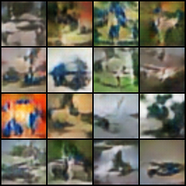
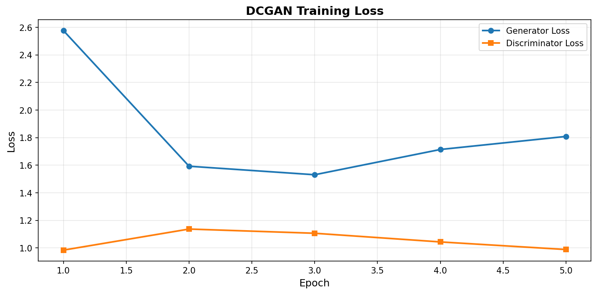

# Deep Convolutional Generative Adversarial Network (DCGAN)

敵対的生成ネットワーク（GAN）を使用した画像生成の実装です。生成器（Generator）と識別器（Discriminator）を競わせることで、リアルな画像を生成することを目指します。

[](https://github.com/nyantaro723/Deep_Convolutional_GAN/actions/workflows/test.yml)
[](https://www.python.org/)
[](LICENSE)

## 概要

### GAN (Generative Adversarial Network) とは

GANは二つのニューラルネットワークが競い合うことで学習を進める仕組みです：

- **生成器 (Generator, G)**: ノイズから偽の画像を生成
- **識別器 (Discriminator, D)**: 本物と偽物を区別

### DCGAN の特徴

**DCGAN (Deep Convolutional GAN)** は、GANに畳み込みニューラルネットワーク（CNN）を組み合わせたモデルです。

**特徴:**
- 生成器: 転置畳み込み層を使用してテンソルを拡大
- 識別器: 通常の畳み込み層を使用して特徴抽出
- バッチ正規化（Batch Normalization）でトレーニングを安定化
- LeakyReLUを使用した活性化関数

---

### GAN の損失関数

識別器と生成器はミニマックスゲームをプレイします：

$$\min_G \max_D V(D, G) = \mathbb{E}_{x \sim p_{\text{data}}(x)}[\log D(x)] + \mathbb{E}_{z \sim p_z(z)}[\log(1 - D(G(z)))]$$

ここで：
- $x$: 本物の画像
- $z$: ランダムノイズ
- $D(x)$: 識別器の出力（本物である確率）
- $G(z)$: 生成器の出力（生成画像）

### 訓練プロセス

**1. 識別器の更新**
$$\nabla_D \left[ \mathbb{E}_x[\log D(x)] + \mathbb{E}_z[\log(1 - D(G(z)))] \right]$$

**2. 生成器の更新**
$$\nabla_G \mathbb{E}_z[\log(1 - D(G(z)))]$$

または実務では以下を使用（より安定）：
$$\nabla_G \mathbb{E}_z[-\log D(G(z))]$$

### 画像生成アルゴリズム（数式概要）

- **入力分布**: ノイズ $z \sim \mathcal{N}(0, I)$、実画像 $x \sim p_{\text{data}}(x)$
- **生成器の写像**: $\hat{x} = G_\theta(z)$（$\theta$ は生成器パラメータ）
- **識別器の出力**: $D_\phi(x) = \sigma(f_\phi(x)) \in (0, 1)$（$\phi$ は識別器パラメータ, $\sigma$ はシグモイド）

**識別器の損失 (二値交差エントロピー):**
$$\mathcal{L}_D = -\mathbb{E}_{x \sim p_{\text{data}}} [\log D_\phi(x)] - \mathbb{E}_{z \sim p_z} [\log (1 - D_\phi(G_\theta(z)))]$$

**生成器の損失 (非飽和型推奨):**
$$\mathcal{L}_G = -\mathbb{E}_{z \sim p_z} [\log D_\phi(G_\theta(z))]$$

**更新ステップ (1バッチ当たりの流れ):**
1. $z \sim p_z(z)$ をサンプリングし $\hat{x} = G_\theta(z)$ を生成
2. 実画像 $x$ と $\hat{x}$ を識別器に通し $D_\phi(x), D_\phi(\hat{x})$ を得る
3. $\mathcal{L}_D$ を計算し $\phi \leftarrow \phi - \eta_D \nabla_\phi \mathcal{L}_D$
4. $z$ を再サンプルし $\mathcal{L}_G$ を計算、$\theta \leftarrow \theta - \eta_G \nabla_\theta \mathcal{L}_G$

**推論時 (画像生成):**
$$z \sim \mathcal{N}(0, I), \quad \hat{x} = G_\theta(z)$$
識別器は不要で、生成器のみで画像をサンプリングします。

## アーキテクチャ

### 生成器 (Generator)

```
入力: ランダムノイズ z (100次元)
  ↓
全結合層 → 4×4×512
  ↓
転置畳み込み層 + BatchNorm + ReLU (4×4→8×8)
  ↓
転置畳み込み層 + BatchNorm + ReLU (8×8→16×16)
  ↓
転置畳み込み層 + BatchNorm + ReLU (16×16→32×32)
  ↓
転置畳み込み層 + Tanh (32×32→64×64)
  ↓
出力: 生成画像 (64×64×3)
```

### 識別器 (Discriminator)

```
入力: 画像 (64×64×3)
  ↓
畳み込み層 + LeakyReLU (64×64→32×32)
  ↓
畳み込み層 + BatchNorm + LeakyReLU (32×32→16×16)
  ↓
畳み込み層 + BatchNorm + LeakyReLU (16×16→8×8)
  ↓
畳み込み層 + BatchNorm + LeakyReLU (8×8→4×4)
  ↓
全結合層
  ↓
出力: スカラー値 (本物である確率)
```

## 主な手法と工夫

| 手法 | 説明 |
|------|------|
| **Batch Normalization** | 各層の入力を正規化し、トレーニングを安定化 |
| **LeakyReLU** | 識別器で使用。負の領域でも勾配が流れる |
| **Transposed Convolution** | 生成器で使用。テンソルを拡大 |
| **Label Smoothing** | 過学習を防止するため、ターゲットラベルを平滑化 |
| **Spectral Normalization** | 識別器の重みを正規化（オプション） |

## ファイル構成

```
Deep_Convolutional_GAN/
├── dcgan.py                  # DCGAN実装（モデル定義）
├── train.py                  # 訓練スクリプト
├── checkpoints/              # 学習済みモデル保存用
└── outputs/                  # 生成画像保存用
```

---

## インストール

```bash
# リポジトリのクローン
git clone https://github.com/nyantaro723/Deep_Convolutional_GAN.git
cd Deep_Convolutional_GAN

# 仮想環境 (推奨)
python3 -m venv .venv
source .venv/bin/activate

# 依存ライブラリのインストール
pip install -r requirements.txt
```

### 必要なライブラリ

- PyTorch >= 1.9.0
- torchvision >= 0.10.0
- numpy
- matplotlib
- Pillow

---

## 使用方法

### モデルの訓練

```bash
python train.py \
    --dataset cifar10 \
    --batch_size 128 \
    --num_epochs 100 \
    --learning_rate 0.0002 \
    --save_interval 10
```

#### パラメータ

| パラメータ | デフォルト | 説明 |
|----------|---------|------|
| `--dataset` | cifar10 | 使用するデータセット |
| `--batch_size` | 128 | バッチサイズ |
| `--num_epochs` | 100 | 訓練エポック数 |
| `--learning_rate` | 0.0002 | Adam最適化器の学習率 |
| `--beta1` | 0.5 | Adamの第1モーメント係数 |
| `--save_interval` | 10 | モデル保存の間隔（エポック） |
| `--device` | cuda | 計算デバイス（cuda/cpu） |

### 生成画像の確認

```python
from dcgan import Generator
import torch
from torchvision.utils import save_image

# モデルロード
device = torch.device('cuda' if torch.cuda.is_available() else 'cpu')
gen = Generator().to(device)
gen.load_state_dict(torch.load('checkpoints/generator_epoch_50.pth'))
gen.eval()

# 画像生成
with torch.no_grad():
    z = torch.randn(16, 100, 1, 1, device=device)
    fake_images = gen(z)
    save_image(fake_images, 'generated_images.png', normalize=True)
```

### 生成画像サンプルと埋め込み例

```bash
python generate.py \
  --checkpoint checkpoints/generator_final.pth \
  --num_images 16 \
  --output outputs/generated_samples.png
```

```markdown

```

### 訓練損失グラフ (例)

`train.py` 実行後に保存される損失曲線を埋め込むには、同じくリポジトリ内の相対パスで指定します。

```markdown

```

`outputs/training_loss.png` がコミットされていれば、GitHub上でも表示されます。

## 訓練結果の可視化

```python
import matplotlib.pyplot as plt

# 訓練ログを読み込み
d_losses = [...]  # 識別器の損失
g_losses = [...]  # 生成器の損失

plt.figure(figsize=(10, 5))
plt.plot(d_losses, label='Discriminator Loss')
plt.plot(g_losses, label='Generator Loss')
plt.xlabel('Epoch')
plt.ylabel('Loss')
plt.legend()
plt.savefig('training_loss.png')
plt.show()
```

---

## 実装のポイント

### 1. 重み初期化

```python
def weights_init(m):
    classname = m.__class__.__name__
    if classname.find('Conv') != -1:
        torch.nn.init.normal_(m.weight.data, 0.0, 0.02)
    elif classname.find('BatchNorm') != -1:
        torch.nn.init.normal_(m.weight.data, 1.0, 0.02)
        torch.nn.init.constant_(m.bias.data, 0)
```

### 2. 損失関数

識別器と生成器で異なる損失関数を使用：

```python
# 識別器
loss_fn = nn.BCELoss()

# 識別器の損失
d_loss = loss_fn(D(real_images), real_labels) + \
         loss_fn(D(fake_images.detach()), fake_labels)

# 生成器の損失
g_loss = loss_fn(D(fake_images), real_labels)
```

### 3. 訓練ループ

- 識別器を複数回更新してから生成器を更新
- グラデーション消失を防ぐため、生成器の損失計算時にDetach()を活用
- 定期的にチェックポイントを保存

---

## 使用データセット

- CIFAR-10 Dataset

## 動作確認済み環境

- Ubuntu 22.04, 24.04
- macOS 14 (Sonoma)
- Python 3.9, 3.10, 3.11, 3.12

---

## 参考資料

- **元論文**: "Unsupervised Representation Learning with Deep Convolutional Generative Adversarial Networks" (Radford et al., 2015)
- **参考スライド**: [アドバンストビジョン第4回](https://ryuichiueda.github.io/slides_marp/advanced_vision/lesson4.html)
- **PyTorch公式チュートリアル**: https://pytorch.org/tutorials/beginner/dcgan_faces_tutorial.html

---

## ライセンス

- このプロジェクトはMITライセンスの下で公開されています。  
- 詳細は [LICENSE](LICENSE) ファイルを参照してください。

© 2025 Ryusei Matsuki
